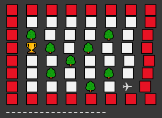
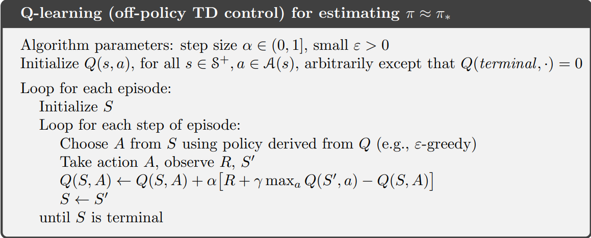
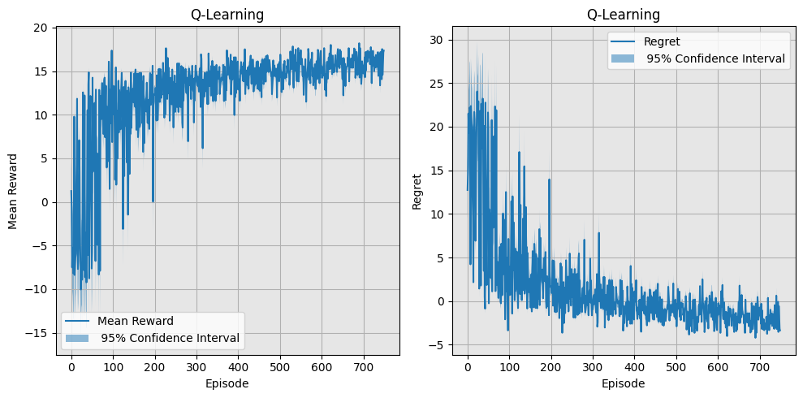
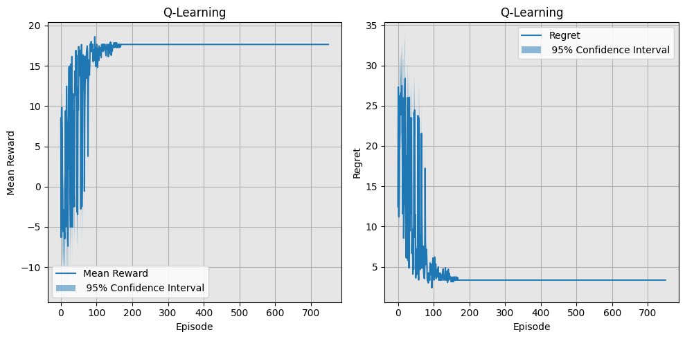
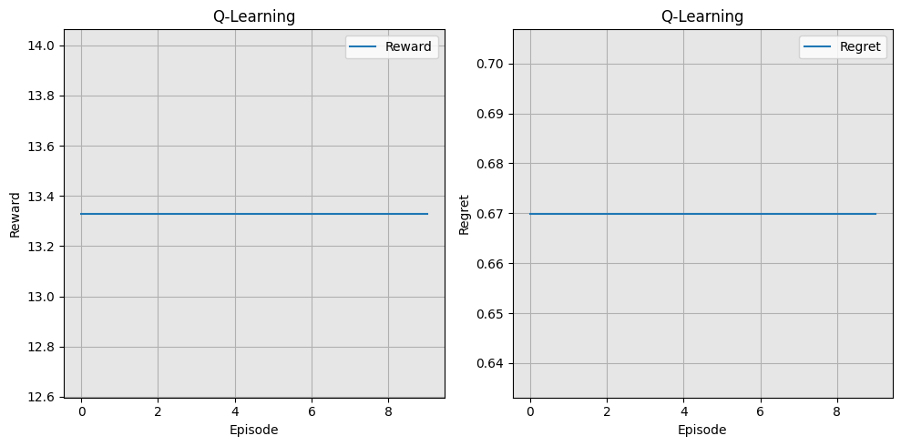
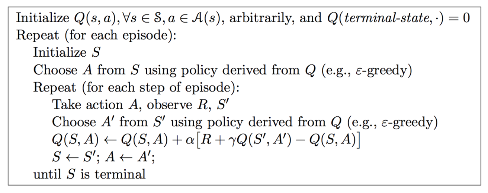
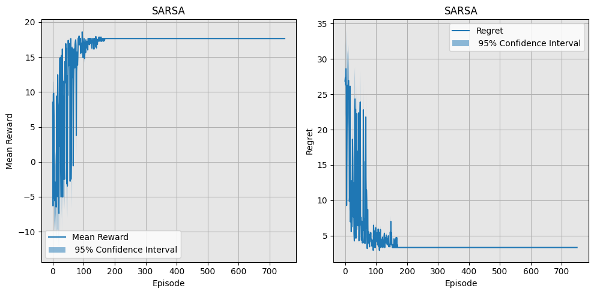
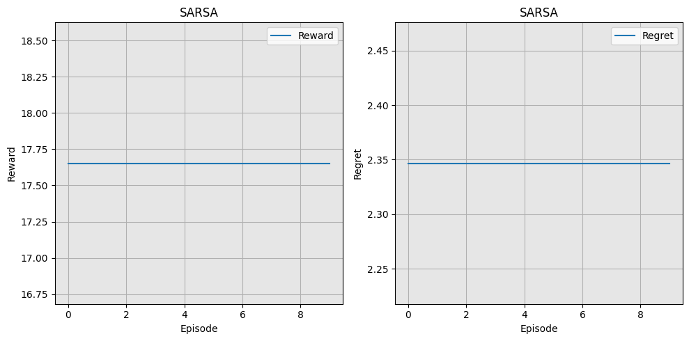

# Drone
In this repository, an RL environment called `Windy Drone` is implemented **from scratch**. Additionally, multiple tabular RL algorithms, including **Q-learning**, **SARSA**, **n-step Tree Backup**, **Policy Iteration**, and **Monte Carlo**, have been tested on it.
## Windy Drone Environment
This environment is a **6×6 gridworld** where a drone starts at a specific position and must reach the destination point without hitting obstacles.
The starting point is **randomly** chosen from one of the two sets of candidate positions, and the destination point is **randomly** chosen from the other set:
```python
Candidates1 = np.array([np.array([0,0]), np.array([0,1]), np.array([0,2]), np.array([1,0]), np.array([1,1]), np.array([2,0])])
Candidates2 = np.array([np.array([3,5]), np.array([4,4]), np.array([4,5]), np.array([5,3]), np.array([5,4]), np.array([5,5])])
```
There are also **8 trees** as obstacles, which the drone must avoid. At most 2 trees are adjacent, and only 2 trees are on the borders. The trees are arranged to avoid creating dead-ends. The positions of the trees are **randomly** chosen.

The **reward function** follows a **Gaussian distribution** with the following <ins>means</ins> and <ins>standard deviations</ins>:
* A <ins>negative reward</ins> for hitting trees, with a **mean of -1** and a **standard deviation of 0.5**.
* A <ins>negative reward</ins> for each transition, with a **mean of -0.5** and a **standard deviation of 0.25**.
* A <ins>positive reward</ins> for reaching the destination, with a **mean of 25** and a **standard deviation of 5**.

The drone also has two additional attributes: a **battery** and a **health bar**.
* The drone starts each episode with <ins>100% battery</ins> and loses battery charge with each transition, following a normal distribution with a **mean of 0.35** and a **standard deviation of 0.15**.
  * If the battery level drops <ins>below 5%</ins>, the episode is **truncated**, and the drone must return to the starting point for recharging.
* As for its health bar, the drone starts with <ins>100% health</ins> and loses health upon hitting trees, following a normal distribution with a **mean of 0.2** and a **standard deviation of 0.1**.
  * If the health bar drops <ins>below 15%</ins>, the episode is **truncated**, and the drone must return to the starting point.

A sample rendering of the environment is shown below.



The following results were generated using *seed=456*.

## Q-Learning
The pseudocode for the Q-Learning algorithm is as follows:



Training and test results of a **Q-learning agent** with the 2 following configurations are depicted below.
* α=0.1
  * An <ins>exponential decay</ins> of epsilon with a rate of 0.999 with the starting value of 0.9
  * Discount Factor $\gamma = 0.9$
* α=0.1, which decays with a rate of 0.99
  * An <ins>exponential decay</ins> for epsilon with a rate of 0.99 with the starting value of 0.9
  * Discount Factor $\gamma = 0.9$

| α | Training Reward | Test Reward |
| --- | --- | --- |
| **Fixed** |  |  |
| **Decaying** |  |  |

The regret is calculated using the following expression:
$$L_t = \mathbb{E} \left[ \sum_{\tau=1}^{t} \left( V^* - Q(a_\tau) \right) \right]$$

*where*:
- $\mathbb{E}$ denotes the expectation.
- $\sum_{\tau=1}^{t}$ represents the summation over time steps from 1 to t.
- $V^*$ is the optimal value function.
- $Q(a_\tau)$ is the action-value function for action $a_\tau$ at time $\tau$.

## SARSA
The pseudocode for the SARSA algorithm is as follows:



Training and test results of a **SARSA agent** with the following configuration are depicted below.
* α=0.1
* An <ins>exponential decay</ins> for epsilon with a rate of 0.99 with the starting value of 0.9
* Discount Factor $\gamma = 0.9$

| Training Reward | Test Reward |
| --- | --- |
|  |  |

## ## Tree backup n-step
