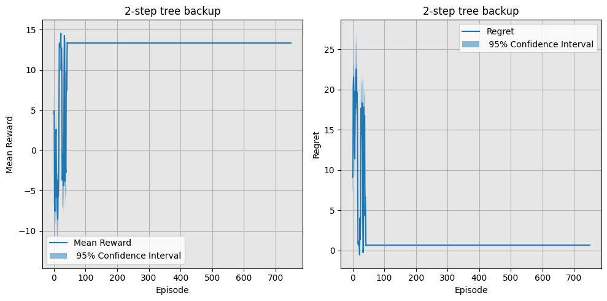

# Drone
In this repository, an RL environment called `Windy Drone` is implemented **from scratch**. Additionally, multiple tabular RL algorithms, including **Q-learning**, **SARSA**, **n-step Tree Backup**, and **Monte Carlo**, have been tested on it.
## Windy Drone Environment
This environment is a **6×6 gridworld** where a drone starts at a specific position and must reach the destination point without hitting obstacles.
The starting point is **randomly** chosen from one of the two sets of candidate positions, and the destination point is **randomly** chosen from the other set:
```python
Candidates1 = np.array([np.array([0,0]), np.array([0,1]), np.array([0,2]), np.array([1,0]), np.array([1,1]), np.array([2,0])])
Candidates2 = np.array([np.array([3,5]), np.array([4,4]), np.array([4,5]), np.array([5,3]), np.array([5,4]), np.array([5,5])])
```
There are also **8 trees** as obstacles, which the drone must avoid. At most 2 trees are adjacent, and only 2 trees are on the borders. The trees are arranged to avoid creating dead-ends. The positions of the trees are **randomly** chosen.

The **reward function** follows a **Gaussian distribution** with the following <ins>means</ins> and <ins>standard deviations</ins>:
* A <ins>negative reward</ins> for hitting trees, with a **mean of -1** and a **standard deviation of 0.5**.
* A <ins>negative reward</ins> for each transition, with a **mean of -0.5** and a **standard deviation of 0.25**.
* A <ins>positive reward</ins> for reaching the destination, with a **mean of 25** and a **standard deviation of 5**.

The drone also has two additional attributes: a **battery** and a **health bar**.
* The drone starts each episode with <ins>100% battery</ins> and loses battery charge with each transition, following a normal distribution with a **mean of 0.35** and a **standard deviation of 0.15**.
  * If the battery level drops <ins>below 5%</ins>, the episode is **truncated**, and the drone must return to the starting point for recharging.
* As for its health bar, the drone starts with <ins>100% health</ins> and loses health upon hitting trees, following a normal distribution with a **mean of 0.2** and a **standard deviation of 0.1**.
  * If the health bar drops <ins>below 15%</ins>, the episode is **truncated**, and the drone must return to the starting point.

A sample rendering of the environment is shown below.


The following results were generated using *seed=456*.

## Q-Learning
The pseudocode for the Q-Learning algorithm is as follows:


The algorithm is implemented **from scratch** as below.
```python
class QLearner:
    def __init__(self, env, decay_alpha=False, alpha=0.1, gamma=0.9, epsilon=0.9, xi=0.999, seed=456):
        self.env = env
        num_states = env.observation_space.n
        self.num_actions = env.action_space.n
        self.alpha = alpha
        self.gamma = gamma
        self.epsilon = epsilon
        self.xi = xi
        self.q_table = np.zeros((num_states, self.num_actions))
        self.decay_alpha = decay_alpha
        np.random.seed(seed)

    def update_q_table(self, state, next_state, reward, action):
        self.q_table[state][action] += self.alpha * (reward + self.gamma * np.max(self.q_table[next_state]) - self.q_table[state][action])

    def behavior_policy(self, state):

        if np.random.uniform() <= self.epsilon:
          action = self.env.action_space.sample()
        else:
          action = self.target_policy(state)

        # self.update_param()
        return action

    def target_policy(self, state):
        return np.argmax(self.q_table[state])

    def update_param(self):
        self.epsilon *= self.xi
        if self.decay_alpha:
          self.alpha *= self.xi
```
Training and test results of a **Q-learning agent** with the 2 following configurations are depicted below.
* α=0.1
  * An <ins>exponential decay</ins> of epsilon with a rate of 0.999 with the starting value of 0.9
  * Discount Factor $\gamma = 0.9$
* α=0.1, which decays with a rate of 0.99
  * An <ins>exponential decay</ins> for epsilon with a rate of 0.99 with the starting value of 0.9
  * Discount Factor $\gamma = 0.9$

| α | Training Reward | Test Reward |
| --- | --- | --- |
| **Fixed** |  |  |
| **Decaying** |  |  |

The **regret** is calculated using the following expression:
$$L_t = \mathbb{E} \left[ \sum_{\tau=1}^{t} \left( V^* - Q(a_\tau) \right) \right]$$

*where*:
- $\mathbb{E}$ denotes the expectation.
- $\sum_{\tau=1}^{t}$ represents the summation over time steps from 1 to t.
- $V^*$ is the optimal value function.
- $Q(a_\tau)$ is the action-value function for action $a_\tau$ at time $\tau$.

## SARSA
The pseudocode for the SARSA algorithm is as follows:


The algorithm is implemented **from scratch** as below.
```python
class SARSA:
    def __init__(self, env, alpha=0.1, gamma=0.9, epsilon=0.9, xi=0.99, seed=456):
        self.env = env
        num_states = env.observation_space.n
        self.num_actions = env.action_space.n
        self.alpha = alpha
        self.gamma = gamma
        self.epsilon = epsilon
        self.xi = xi
        self.q_table = np.zeros((num_states, self.num_actions))
        self.prev_state = None
        self.prev_action = None
        np.random.seed(seed)

    def learn(self, obs, next_obs, reward, action, next_action):
        predict = self.q_table[obs][action]
        target = reward + self.gamma*self.q_table[next_obs][next_action]
        self.q_table[obs][action] += self.alpha * (target - predict)

    def choose_action(self, obs):

        if np.random.uniform() <= self.epsilon:
          action = self.env.action_space.sample()
        else:
          action = np.argmax(self.q_table[obs])

        return action

    def update_param(self):
        self.epsilon *= self.xi
```
Training and test results of a **SARSA agent** with the following configuration are depicted below.
* α=0.1
* An <ins>exponential decay</ins> for epsilon with a rate of 0.99 with the starting value of 0.9
* Discount Factor $\gamma = 0.9$

| Training Reward | Test Reward |
| --- | --- |
|  |  |

## Tree backup n-step
The pseudocode for the Q-Learning algorithm is as follows:


The algorithm is implemented **from scratch** as below.
```python
class NStepTreeBackupAgent:
    def __init__(self, env, alpha=0.1, gamma=0.9, n=3):
        self.env = env
        self.alpha = alpha
        self.gamma = gamma
        self.n = n
        num_states = env.observation_space.n
        self.num_actions = env.action_space.n
        self.Q = np.zeros((num_states, self.num_actions))

    def take_action(self, state):
        return np.argmax(self.Q[state])

    def learn(self, optimal_reward, episodes=750):
        episodes_rewards = []
        episodes_regrets = []
        for episode in range(episodes):
            state, _ = self.env.reset()
            terminated = truncated = False
            t = 0
            T = float('inf')
            rewards = []

            while not terminated and not truncated:
                if t < T:
                    action = self.take_action(state)
                    next_state, reward, terminated, truncated, _ = self.env.step(action)

                    rewards.append(reward)

                    if terminated or truncated:
                        T = t + 1

                tau = t - self.n + 1
                if tau >= 0:
                    if t + 1 >= T:
                        G = rewards[-1]  # R_T
                    else:
                        # Compute G using the given tree backup algorithm
                        G = rewards[-1] + self.gamma * self.Q[next_state, self.take_action(next_state)]

                        k_end = min(t, T - 1)
                        for k in range(k_end, tau, -1):
                            G = rewards[k] + self.gamma * G

                    # Update Q-value for the current state-action pair
                    action = self.take_action(state)
                    self.Q[state, action] += self.alpha * (G - self.Q[state, action])

                state = next_state
                t += 1

            episodes_rewards.append(np.sum(rewards))
            episodes_regrets.append(optimal_reward-np.sum(rewards))  # Assuming the optimal reward is 0 for simplicity

        return episodes_rewards, episodes_regrets

```
Training and test results of a **Tree backup n-step agent** with the 3 following configurations are depicted below.
* n = 1
  * $\alpha = 0.1, \gamma = 0.9$ 
* n = 2
  * $\alpha = 0.1, \gamma = 0.9$
* n = 3
  * $\alpha = 0.2, \gamma = 0.9$
 
| n | Training Reward | Test Reward |
| --- | --- | --- |
| **1** |  |  |
| **2** |  |  |
| **3** |  |  |

## On-policy Monte-carlo
The pseudocode for the On-policy Monte-carlo algorithm is as follows:


The algorithm is implemented **from scratch** as below.
```python
class MonteCarloAgent:
    def __init__(self, env, gamma=0.9, epsilon=0.9, xi=0.99, seed=456):
        self.env = env
        self.num_states = env.observation_space.n
        self.num_actions = env.action_space.n
        self.gamma = gamma
        self.epsilon = epsilon
        self.Q = np.zeros((self.num_states, self.num_actions))
        self.returns = {}
        self.transitions = np.zeros((self.num_states, self.num_actions, self.num_states))
        self.rewards = np.zeros((self.num_states, self.num_actions, self.num_states))
        self.episode = []
        self.xi = xi
        np.random.seed(456)

    def choose_action(self, state):
        if np.random.uniform(0, 1) < self.epsilon:
            return np.random.choice(self.num_actions)
        else:
            return np.argmax(self.Q[state])

    def remember(self, state, next_state, reward, action, next_action):
        self.episode.append((state, action, reward))

    def learn_env(self):
        states, actions, rewards = zip(*self.episode)
        for t in range(len(states) - 1):
                s = states[t]
                a = actions[t]
                r = rewards[t]
                s_next = states[t + 1]

                # Update state transition counts and rewards
                self.transitions[s, a, s_next] += 1
                self.rewards[s, a, s_next] += r

    def transition_predictor(self, state, action):
        transition_probabilities = rewards_func = np.zeros((self.num_states))
        total_transitions = np.sum(self.transitions[state, action])
        if total_transitions > 0:
            transition_probabilities = self.transitions[state, action] / total_transitions
            rewards_func = self.rewards[state, action] / total_transitions

        return rewards_func, transition_probabilities


    def update_Q(self):
        G = 0
        for t in reversed(range(len(self.episode))):
            state, action, reward = self.episode[t]

            G = self.gamma * G + reward
            # if not any(np.array_equal(state, e[0]) and action == e[1] for e in self.episode[:t]): #First visit
            if (state, action) not in self.returns:
                self.returns[(state, action)] = []
            self.returns[(state, action)].append(G)
            self.Q[state, action] = np.mean(self.returns[(state, action)])
        self.episode.clear()
        if not self.xi==None :self.epsilon *= self.xi
```
Training and test results of a **Every-Visit Monte-carlo agent** with the following configuration are depicted below.
* $\gamma = 0.9$
* An <ins>exponential decay</ins> for epsilon with a rate of 0.99 with the starting value of 0.9

| Training Reward | Test Reward |
| --- | --- |
|  |  |

## Course Description
- **Course**: Interactive Learning [ECE 641]
- **Semester**: Fall 2023
- **Institution:** [School of Electrical & Computer Engineering](https://ece.ut.ac.ir/en/), [College of Engineering](https://eng.ut.ac.ir/en), [University of Tehran](https://ut.ac.ir/en)
- **Instructor:** Prof. Nili-Ahmadabadi
